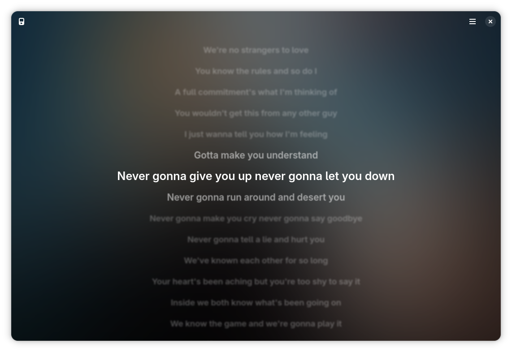

# Chorus

> *View the lyrics for your currently playing music.*

Chorus watches whatever media player is running on your system and shows synced or plain lyrics for the current track, no matter which app you're using[*](#recommended-players).

<p align="center">
  
</p>

## Features

- Follows any MPRIS-compatible player automatically, or pick one manually
- Synced lyrics scroll and highlight the current line as the song plays
- Blurred cover art as a live background (*not available for some players when using Flatpak, due to sandbox limitations*)
- Pluggable lyrics providers, [lrcmux](https://github.com/f1nniboy/lrcmux) by default

## Recommended players

Chorus works with any MPRIS-compatible player, but not all players implement MPRIS equally well. Waylyrics maintains a good list of [recommended players](https://github.com/waylyrics/waylyrics/blob/master/README.en.md#recommended-players) that's equally relevant here.

## Installation

### Flatpak

Download `chorus.flatpak` from the [latest release](https://github.com/f1nniboy/chorus/releases/latest), and install it.

### From source

**Requirements**:
- GTK4
- libadwaita


```sh
git clone https://github.com/f1nniboy/chorus
cd chorus
glib-compile-schemas data/
go build -o chorus ./cmd/chorus
GSETTINGS_SCHEMA_DIR=data ./chorus
```
