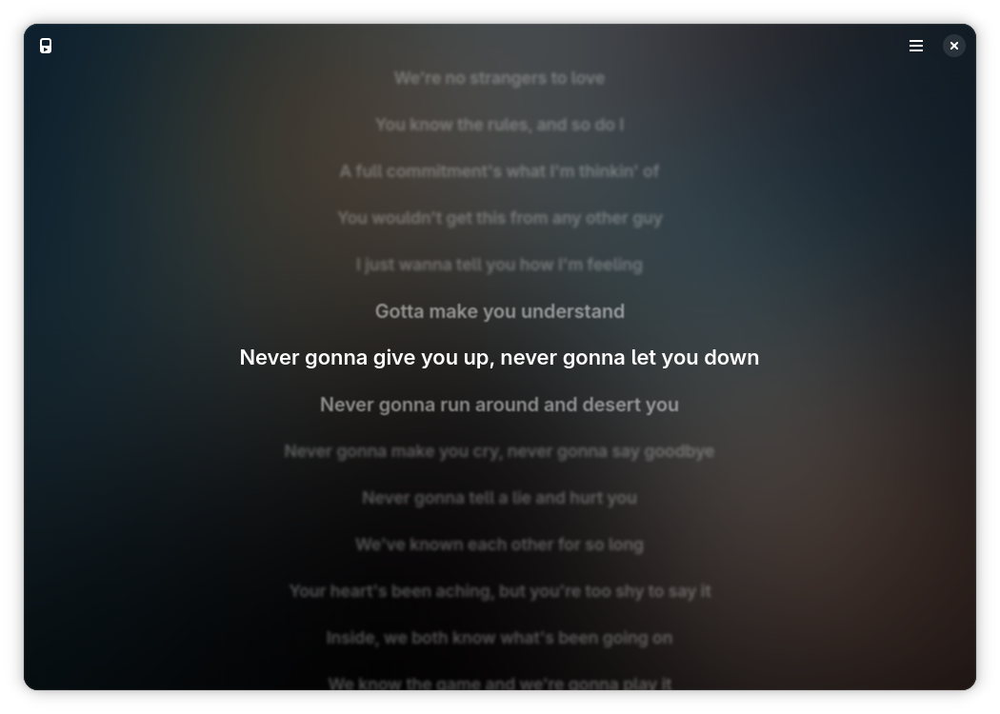

<p align="center">
  
</p>

<h1 align="center">Chorus</h1>

<p align="center">
  Sing along to your music
  <br><br>
  <a href="https://github.com/f1nniboy/chorus/releases"></a>
  <a href="LICENSE"></a>
  <a href="https://matrix.to/#/#chorus:oss.zone"></a>
  <a href="https://hosted.weblate.org/engage/chorus/"></a>
</p>

Chorus watches whatever media player is running on your system and shows synced or plain lyrics for the current track, no matter which app you're using[*](#recommended-players).

<p align="center">
  
</p>

## Features

- Follows any music player automatically, or lets you pick one manually
- Synced lyrics scroll and highlight the current line as the song plays
- Click any line to seek directly to it
- Blurred cover art as a live background

## Recommended players

Chorus works with any MPRIS-compatible player, but not all players implement MPRIS equally well.

| Player | Cover art | Click to seek | Notes |
| --- | :---: | :---: | --- |
| Spotify | :white_check_mark: | :white_check_mark: | |
| TIDAL | :white_check_mark: | :white_check_mark: | |
| Firefox | :x:[^1] | :white_check_mark: | needs [extension](https://addons.mozilla.org/en-US/firefox/addon/plasma-integration/) |
| Chromium | :x:[^1] | :white_check_mark: | |
| Amberol | :x:[^1] | :white_check_mark: | |
| VLC | :x:[^1] | :white_check_mark: | |
| Rufin | :x:[^1] | :white_check_mark: | |
| Gapless | :x:[^1] | :warning: | |

*Missing a player? [Add it](https://github.com/f1nniboy/chorus/edit/main/README.md).*

[^1]: Not available when using the Flatpak build, due to sandbox limitations.

## Installation

### Flatpak

<p>
  <a href="https://flathub.org/apps/space.f1nn.chorus"></a>
</p>

Alternatively, download the `.flatpak` for your architecture from the [latest release](https://github.com/f1nniboy/chorus/releases/latest), and install it.

### From source

**Requirements**:
- GTK4
- libadwaita

```sh
git clone https://github.com/f1nniboy/chorus
cd chorus
glib-compile-schemas data/
go build -o chorus ./cmd/chorus
GSETTINGS_SCHEMA_DIR=data ./chorus
```

## Translate

Chorus is translated on [Weblate](https://hosted.weblate.org/engage/chorus/). Contributions for new or existing languages are welcome.

<a href="https://hosted.weblate.org/engage/chorus/"></a>
